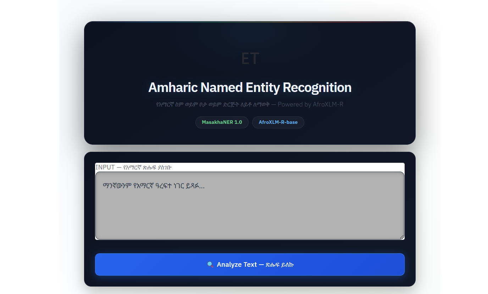
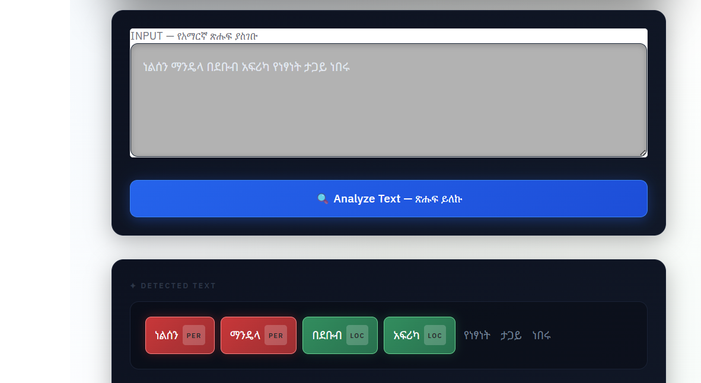
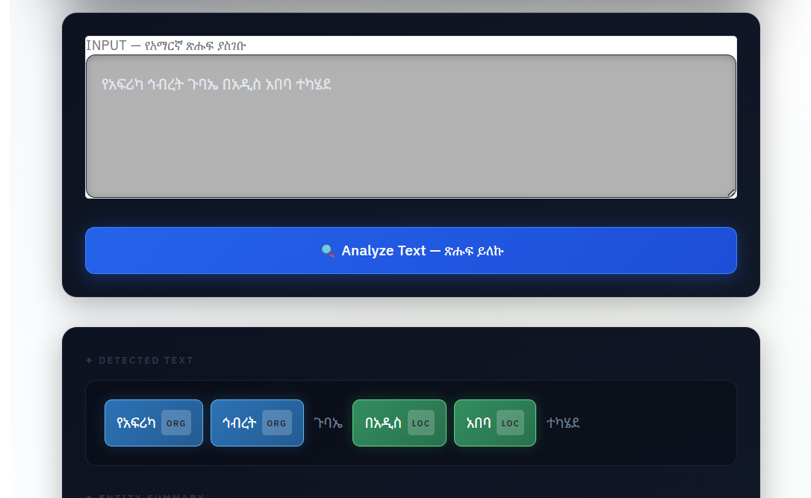
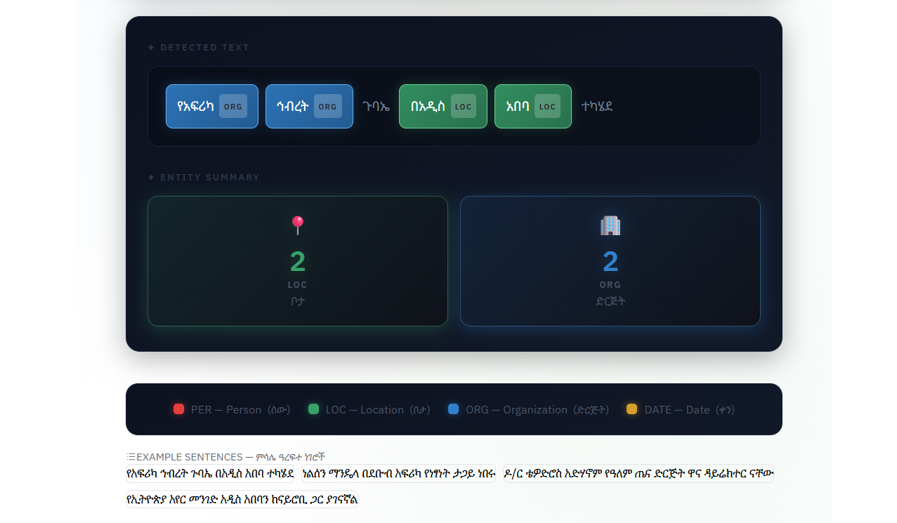

# Amharic Named Entity Recognition

An AI pipeline that classifies customer complaints, extracts structured ticket data, generates empathetic responses, and logs everything to a searchable dashboard.

---

## 🚀 Live Demo

👉 [Try it on Hugging Face Spaces](https://huggingface.co/spaces/Jossi18/amharic-ner)

---
## What It Does

1. Accepts any Amharic sentence as input
2. Tokenizes text using AfroXLM-R subword tokenizer
3. Predicts named entity tags for each token
4. Highlights entities with color-coded chips:
   
   🔴 PER — Person names (ሰው)
   
   🟢 LOC — Locations (ቦታ)
   
   🔵 ORG — Organizations (ድርጅት)
   
   🟡 DATE — Dates (ቀን)
   
5. Displays entity summary cards with counts

---

## Screenshots

| | |
|:---:|:---:|
|  |  |
| *App Interface* | *Person & Location Detection* |
|  |  |
| *Organization & Date Detection* | *Entity Summary Cards* |
---
## Tech Stack

- Python 3.10
- PyTorch — deep learning framework
- HuggingFace Transformers — AfroXLM-R model
- AfroXLM-R-base (Davlan/afro-xlmr-base) — pretrained on 17 African languages including Amharic
- MasakhaNER 1.0 — Amharic NER dataset
- Gradio — web interface
- seqeval — NER evaluation metrics

---
## Architecture

```
amharic-ner/
│
├── app.py                  # Gradio web interface
├── requirements.txt        # Dependencies
├── images/                 # Screenshots
│   ├── screenshot1.png
│   ├── screenshot2.png
│   ├── screenshot3.png
│   └── screenshot4.png
└── saved_model/            # Trained model (hosted on HuggingFace)
    ├── config.json
    ├── pytorch_model.bin
    ├── tokenizer files
    └── ner_config.json
```

---

## Evaluation

```
(AfroXLM-R-base): 0.76 
```
---

## Running Locally

```bash
# Clone the repository
git clone https://github.com/YOUR_USERNAME/amharic-ner
cd amharic-ner

# Install dependencies
pip install -r requirements.txt

# Run the app
python app.py
```
